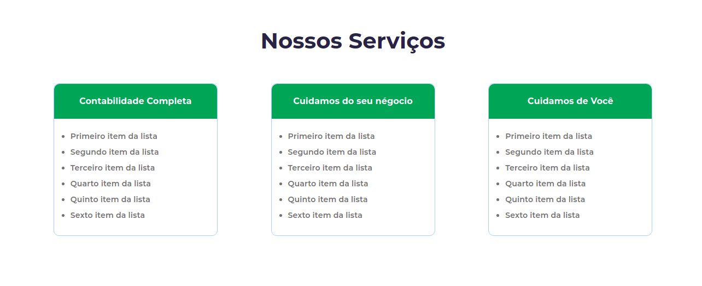
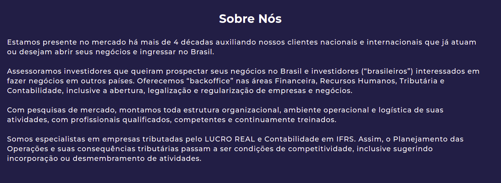

# Dev-Contábil

> Site relacionado à contabilidade, com introdução ao site, segundo informações adicionais, e terceiro informações sobre o site

### Ajustes e melhorias

O projeto ainda está em desenvolvimento e as próximas atualizações serão voltadas nas seguintes tarefas:

- [ ] Criação do file .JS
- [ ] Tornar a página mais ramificada

## ☕ Usando Dev Contábil

Informações Dev Contábil:

>A barra do cabeçalho tem 3 links relacionados à página, sendo as duas primeiras encarregados de levarem o usuário a ao local clicado, e a terceira usado para

## 🤝 Colaboradores

Agradecemos às seguintes pessoas que contribuíram para este projeto:

<table>
  <tr>
    <td align="center">
      <a href="https://www.linkedin.com/in/natanael-monteiro-64b1b421a/">
         
        
          <b>Natanael</b>
        
      </a>
    </td>
</table>
  
  

  
